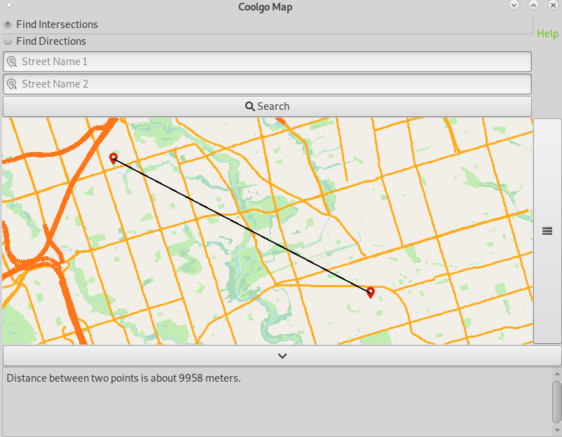

# Coolgo Map
A GIS application, cool as Google Map

Author: Fancy Mao, Jason Wei, and VIctor Wu from ECE 2T4, University of Toronto 

# Get-Started
A simple tutorial on how to use Coolgo Map. Basically, there are two modes for you to interact. One is to Find the intersection, and the other is to Find directions for you to navigate.

## Show the Menu
To show the menu and know more about the oprations, please click the "hamburger" icon on the right side.

  

As shown in the picture, you can explore more functions under the expanded menu.

## Switch Different Modes
There are two modes for you to switch in between. If you would like to find intersections, please switch to mode 1. If you would like to navigate, please use mode 2.

## Mode 1: Find Intersections
### Search Bar Entry
For mode 1, please enter two street names in the search bar (spelling is fine because we have auto-completion)

### RIGHT Mouse Click - Find any intersection
Any RIGHT button mouse click will return the location pin on the nearest intersection and display the information.

### MIDDLE Mouse Click - Disatnce Ruler
In this mode, the MIDDLE button will help you to find the geodistance between two clicked points.

## Mode 2: Find Directions
### Search Bar Entry
For mode 2, please enter two intersection names in the convention of "street 1 and street 2". The "and" keyword is REQUIRED for a successful search event.

### RIGHT Mouse Click - Navigation between two intersections
Similar to mode 1, any RIGHT button mouse click will return the location pin on the intersection.

After you click **2 Intersections**, please click "Search" to find the route between two intersections.

